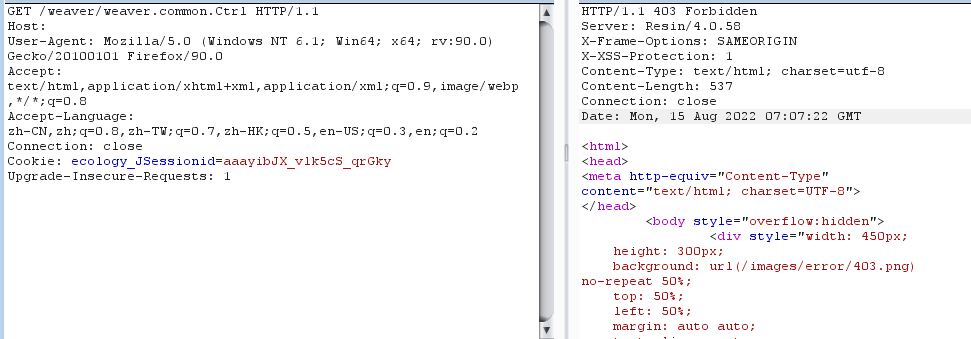
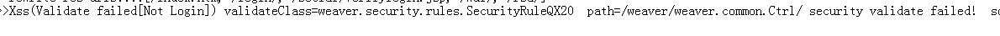
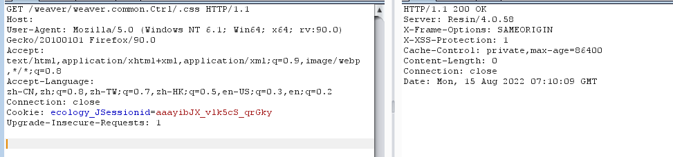
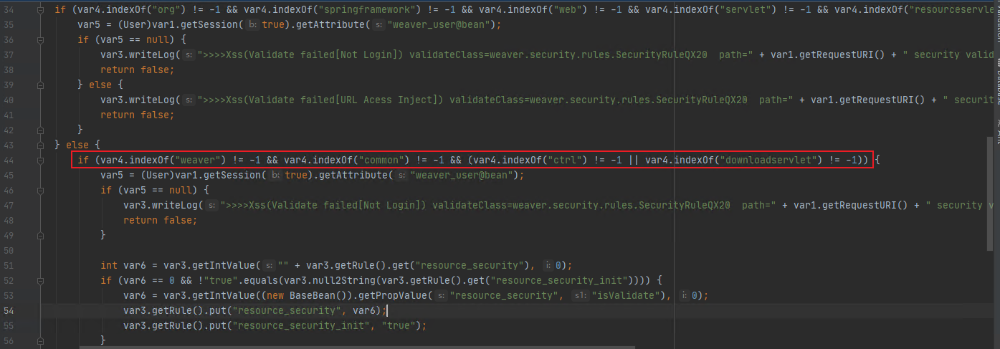

# 泛微e-cology简单分析后的知识汇总

## 文件的简单描述

文件结构

```
WEAVER
├─ecology //泛微e-cology 项目文件
├─Resin   // 泛微oa的服务器

```


关于服务器中我们需要重点关注：

resin.properties 文件，该文件为服务器配置文件，配置远程调试的时候使用到了，具体的其他配置可以[参考说明](https://www.caucho.com/resin-4.0/admin/config-resin-properties.xtp)

ecology目录的项目文件中需要关注的是 WEB-INF目录和classbean目录


## 分析时遇到的一些机制问题

### 泛微ec的路由机制
   泛微ec的路由机制有两种方式

  1.  一种为泛微ec项目中通过xml配置路由
   
  2.   另一种是Resin服务器中默认启用了invoker servlet，由于Resin.conf中存在如下配置: 
    
        访问/weaver/className，就会根据类名调用CLASSPATH下的servlet

        这种servlet方式存在一定的安全隐患，该方式可以通过url访问任何有效servlet的类。
      
```xml
<web-app id="/" root-directory="C:\ecology\ecology">
    <servlet-mapping url-pattern='/weaver/*' servlet-name='invoker'/>
</web-app>
```   


泛微ec的安全机制

    根据对泛微更新补丁分析发现，每次更新泛微都会更新大量的xml其中主要内容是针对url添加限制条件。
    
    还会有有单独的安全类继承ParentRule类，并对BaseRule和StaticResourceBaseRule类进附加额外功能。

    该机制是通过web.xml中配置的安全过滤器实现：

```xml
<filter>
    <filter-name>SecurityFilter</filter-name>
    <filter-class>weaver.filter.SecurityFilter</filter-class>
</filter>
<filter-mapping>
    <filter-name>SecurityFilter</filter-name>
    <url-pattern>/*</url-pattern>
</filter-mapping>
```


## 以下漏洞分析为例


以前台任意文件上传漏洞为例，poc如下：


> /weaver/weaver.common.Ctrl/.css?arg0=com.cloudstore.api.service.Service_CheckApp&arg1=validateApp


根据poc内容进行测试，发现`/weaver/weaver.common.Ctrl`访问后为403禁止访问


发现被记录安全日志


而`/weaver/weaver.common.Ctrl/.css` 访问后为200，很显然是绕过了某些限制





根据上边的安全日志，我们可以知道`weaver.security.rules.SecurityRuleQX20`这个安全类对该路径进行了防护,根据该类的源码信息来看，是对URL中包含字符 weaver ， common , ctrl 字符的访问进行拦截。





那接下来有一个问题，**对于绕过的情况来看符合该类的拦截情况的，但是为什么没有拦截呢？**

猜测可能是安全过滤器中存在某些优先的处理，根据web.xml我们了解到存在SecurityFilter过滤器，即安全过滤器。